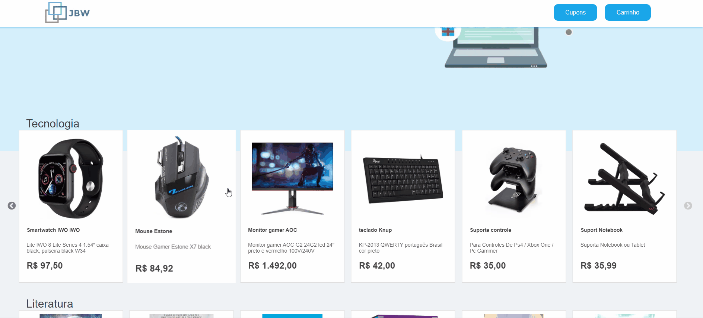
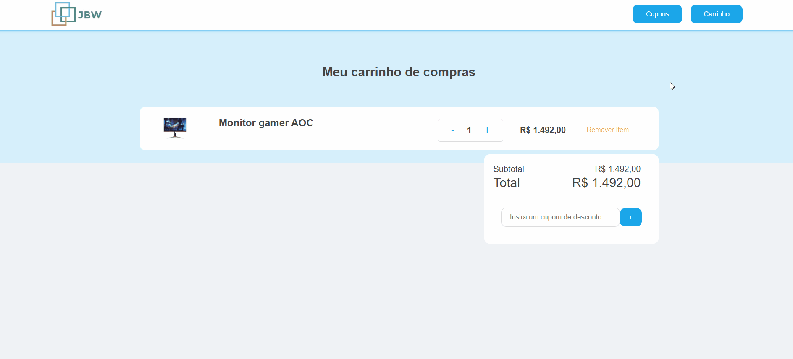

<div align="center">
 <h1>JBW - Shop</h1>
 <h2>Project Description</h2>
 <p>The JBW is a E-commerce project of sale of various products.</p>
<p>
 <a href="#Features">Features</a> •
 <a href="#Requirements">Requirements</a> • 
 <a href="#Running the Application">Running the Application</a> • 
 <a href="#Technologies">Technologies</a> • 
 <a href="#Author">Author</a>
</p>
 <br>
 
 <br>
 <br>
 
 <br>
 <br>
 
</div>

### Features

- [x] View the products
- [x] Open a modal to view product information in detail
- [x] View your shopping cart
- [x] Add discount coupon to your purchase

### Requirements

Before you begin, you will need to have the following tools installed on your machine:
[Git](https://git-scm.com) and [Node.js](https://nodejs.org/en/)

### 🎲 Running the Application

```bash
# Clone this repository
$ git clone <https://github.com/JoaoVitorSoares10/JBW-Shop.git>
# Access the project folder in the terminal/cmd
$ cd myshop
# Install dependencies
$ npm install
# Run the application
$ npm dev
# The server will log in to port:8000 - access <http://localhost:8000>
```

### 🛠 Technologies

The following tools were used in the construction of the project:

- [React](https://pt-br.reactjs.org/)
- [TypeScript](https://pt-br.reactjs.org/)
- [Styled-components](https://styled-components.com/)
- [Gatsby](https://www.gatsbyjs.com/)
- [Json Server](https://www.npmjs.com/package/json-server)

### Author

<p>Create by <a href="https://www.linkedin.com/in/joao-vitor-morais-soares-49ba17228/">João Vitor</a></p>
